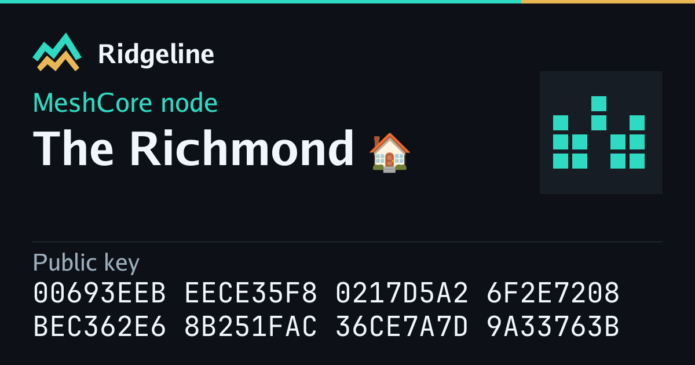

# Public link previews

Ridgeline's Go daemon renders route metadata into the **initial HTML response**
for nodes and public section roots. It also serves a deterministic 1200×630 PNG
at `/share/card.png?path=/nodes/PUBLIC_KEY`. Svelte stays a static SPA: this is
server-rendered metadata, not full Svelte SSR, and needs no Node runtime or browser.

## Build and configuration

Run `cd web && npm ci && npm run build`, then rebuild/restart the daemon as usual.
The postbuild step exports the existing `VITE_SITE_NAME` and `VITE_SITE_URL` from
Vite's production environment into `build/share-site.json`. Set `VITE_SITE_URL`
to the public HTTP(S) **origin** for absolute canonical and image URLs. Never use
request Host or forwarded headers as the canonical origin. A blank origin leaves
relative URLs for local development; configure an origin for reliable unfurling.
A malformed configured origin disables enhanced previews and logs a warning.

Branding uses the normal production build (`npm run build`); if building with a
custom Vite mode, run the postbuild with `NODE_ENV` set to that same mode so it
reads the matching environment file. No credentials go into this manifest.

## Scope and data contract

- `/nodes/{64-hex-key}`: public name, role, identicon and the complete 64-character
  public key. The key is grouped into eight-character blocks on two landscape lines
  or four larger lines for taller formats, using JetBrains Mono. Observation times, activity counts and status are omitted from both the
  card and initial metadata, keeping the identity card stable as traffic arrives.
- Public section roots: overview, nodes, feed, channels, both maps, analytics,
  topology, identity planner and observers. `/m` equivalents canonicalize to
  the desktop route. Existing prerendered pages and static assets are preserved.
- Observer detail cards, arbitrary entity types and full Svelte SSR are follow-ups.
- Missing, retired and quarantined nodes have no public card. The original page
  fallback still works; image requests return 404. No notes, precise coordinates,
  ownership, session data or inferred radio configuration are read.
- The identicon is derived from the identity; it is not a coverage/activity plot.
- Go's bundled regular/bold fonts and embedded JetBrains Mono keep rendering
  offline and deterministic. Font provenance and OFL license are in
  `internal/api/fonts/`; the font and license are embedded in the daemon.
  Known emoji use bundled Noto color PNGs, including flags, skin tones, keycaps
  and joined sequences. Other unsupported glyphs use a visible box in the image;
  full Unicode remains in HTML. Text measurement and truncation keep recognized
  emoji sequences intact, including during sanitization.

## Image formats and small previews

The default Open Graph/Twitter image is `wide`. Add `format` to the image URL
for a different composition, for example:
`/share/card.png?path=/nodes/PUBLIC_KEY&format=square`.

| Format | Pixels | Key layout |
| --- | --- | --- |
| `wide` (default) | 1200 × 630 | 2 rows of 32 hex digits |
| `square` | 1080 × 1080 | 4 rows of 16 hex digits |
| `portrait` | 1080 × 1350 | 4 rows of 16 hex digits |
| `story` | 1080 × 1920 | 4 rows of 16 hex digits |

Only these four formats are accepted; unknown formats return an uncached 400.
The wide identicon aligns to the visible role/title block, including wrapped
titles, and its visible pattern is centered within the panel.
The layout changes with the aspect ratio: the identicon moves above the title,
the title gets more width and the key wraps into larger rows. Story content
leaves room at the top and bottom for interface overlays. Footer captions,
site addresses and extra promotional copy are omitted from the image.

The visual reference is [GitHub's social-card hierarchy](https://github.blog/open-source/git/framework-building-open-graph-images/):
prominent names, a recognizable identity and restrained supporting text.
This is an adaptation, not a claim to match GitHub's internal font sizes.
At a 320px display width, title sizes scale to approximately 21–28px; the key
scales to 12.8px for wide and 21.3px for taller formats. All digits remain visible
without shrinking long names to unreadable sizes. Very long names wrap to two
lines, then ellipsize; the full public key is never shortened. HTML image alt
text also includes the full key.

A PNG cannot reflow after a messaging app downloads it. Platforms choose their
own display size, crop and cache behavior; the additional formats are explicit
image endpoints for sharing/export clients, not automatic platform detection.
The app's standard link metadata continues to advertise only the wide image.
No guarantee is made for tiny icons or a service that crops the supplied image.

## Emoji assets

The pinned [Noto Emoji](https://github.com/googlefonts/noto-emoji) archive contains
3,985 PNGs on 128px canvases (about 21.3 MiB compressed). Country and subdivision
flags are resized without distorting their proportions; other artwork is unmodified. This is the binary-size
tradeoff for offline color emoji without an OS font, browser renderer or CDN
image fetch. Only artwork used in a request is decoded, with a request-local
cache discarded after rendering; the archive and sequence index are read-only.
Licenses, authors, upstream commit, checksum and an update script are included in
`internal/api/emoji`. Joiners and tag characters are preserved only inside known
emoji sequences; unrelated control and directional-format characters are stripped.

## Freshness and caching

A fresh request reads only the public identity fields using an indexed lookup.
The image URL includes a content revision; it changes when the name, role,
branding or card design changes. New observations do not change the HTML, PNG,
image revision or ETag. Both responses use ETags: HTML has a five-minute cache
lifetime so identity edits get a new image URL promptly; PNGs allow a one-day
cache lifetime with revalidation. Images are rendered on demand, with at most
four concurrent renders and no unbounded in-process image cache. Overload returns
503 and Retry-After. Errors and missing images use `no-store`. A CDN can honor
these origin headers; its image cache key must retain `path`, `format` and `v`.
No deployment-specific CDN configuration is required by the renderer.

The image endpoint always returns the current public identity, including for an
old `v` query. It is deliberately **not immutable** and does not store historical
copies. A previously cached image can therefore retain an old name or role (or a
subsequently retired node) until the cache expires. New origin requests still
suppress missing, retired and quarantined records. Sharing services may retain
cards longer and cannot be forced to update already-sent messages. The stable
key and identicon remain useful even when an old card has a former display name.
No timestamps, “online now”, relative ages or activity counters enter the card.

The initial head contains one authoritative metadata set. On client mount,
`Seo.svelte` takes ownership and removes server metadata, then updates image URLs
on navigation so a previous node's card cannot linger in the DOM.

## Examples

Synthetic node data, not a live capture:



[Square](images/share-card-example-square.png) ·
[Portrait](images/share-card-example-portrait.png) ·
[Story](images/share-card-example-story.png)

## Verification / AI development handoff

These implementation notes and the contribution were generated with Codex.
They apply equally to Claude or Codex continuing development.

```sh
go test ./internal/api -run 'TestShare' -count=1
go test ./...
go build ./...
cd web && npm run check && npm run build
```

For a synthetic visual fixture, set `RIDGELINE_SHARE_PREVIEW_SAMPLE` to an absolute
PNG output path while running `TestShareEscapingAndCard`. This writes the wide
fixture there and adds `-square`, `-portrait` and `-story` siblings. These contain
example data, not a captured live node. `TestShareCardLayouts` checks PNG dimensions,
full-key glyph bounds, key reconstruction, title wrapping and a minimum 12px key
font at 320px display width, plus default and invalid format handling. Test the built app through **the Go server**:
Vite preview alone has no Go metadata/image handler. Fetch a node document without
JavaScript, follow its `og:image`, check PNG MIME/dimensions, then test browser
navigation from one node to another and to a prerendered page. Real iMessage /
Discord / WhatsApp unfurl validation requires deployment; local HTTP tests do not
prove those services have refreshed their caches.
